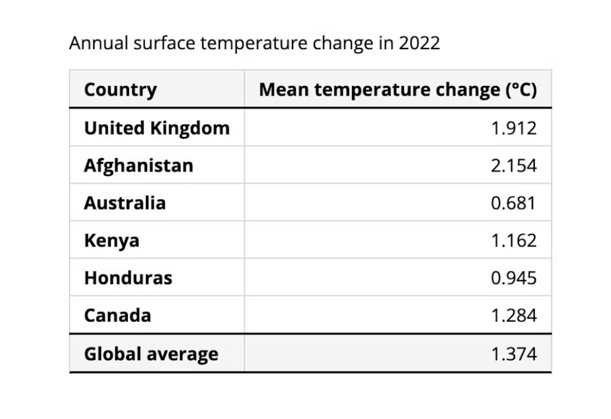
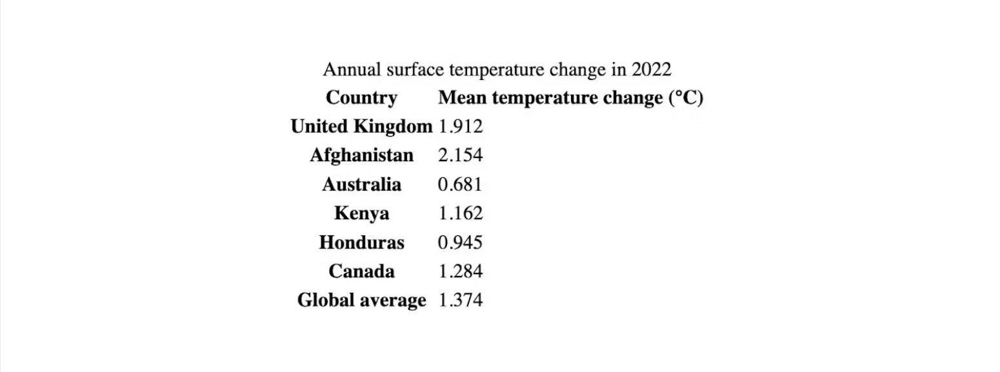
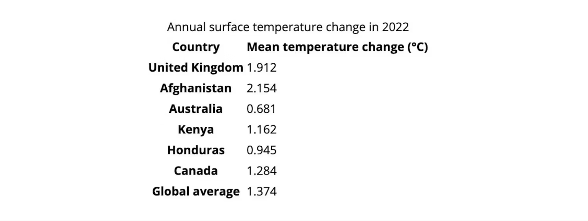
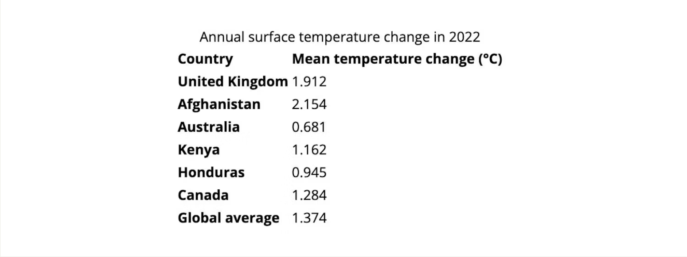
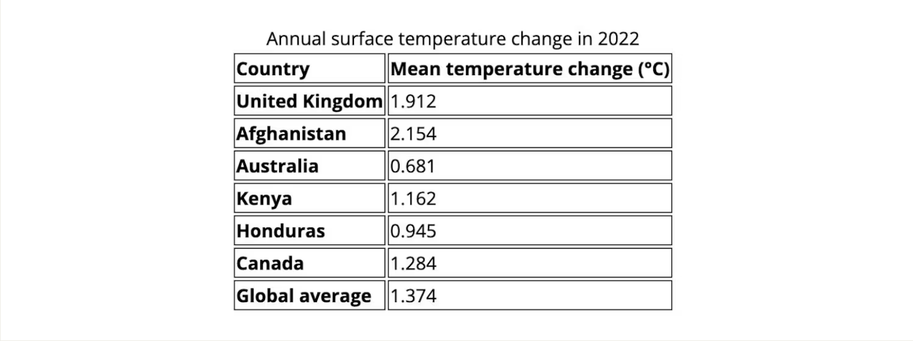
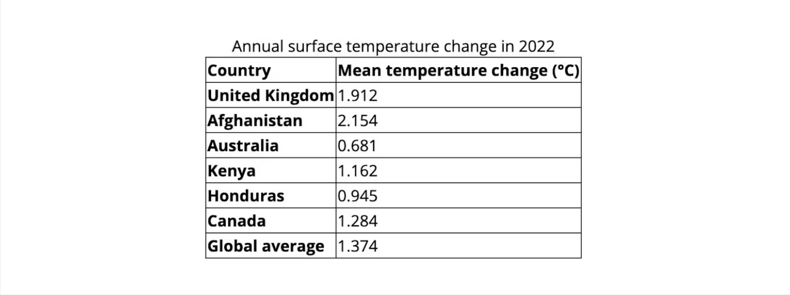
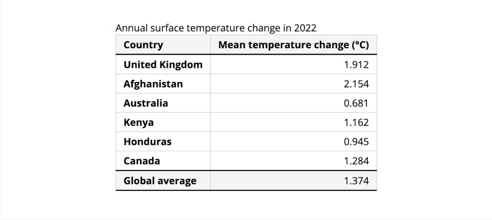
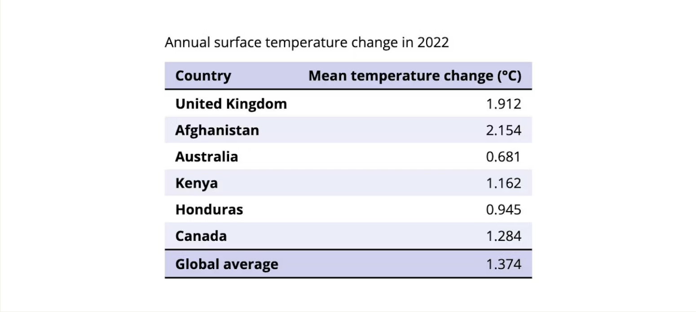
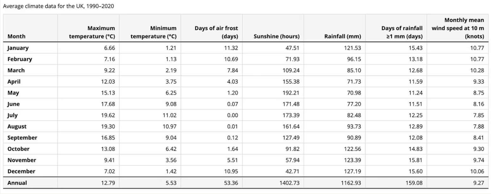

:::tip

转载自：[Styling Tables the Modern CSS Way](https://piccalil.li/blog/styling-tables-the-modern-css-way/)

:::

HTML 表格几乎和网络本身一样古老，几十年来一直被使用和滥用。
从前，无畏的网页设计师在没有其他合适方法的情况下，使用表格将复杂的布局拼凑在一起。
值得庆幸的是，如今这已不再是常见的做法，但表格仍然是网络的重要组成部分，
对于显示表格数据至关重要 —— 按行和列组织的二维数据。

本文最终的实现效果：


在网上创建好看的表格有时会很麻烦。
我们将介绍一些在 HTML 和 CSS 中构建简单和复杂表的技巧和陷阱，
以及现代 CSS 可以帮助我们的地方。

{/* truncate */}

## table 的元素

我们的示例数据展示的是 2022 年全球不同国家的平均温度变化。（来源：[国际货币基金组织](https://climatedata.imf.org/)）

就像任何一篇好的 Piccalilli 文章一样，我们将从普通的标签开始。
这意味着，即使没有任何额外的样式，我们的表格在视觉上也是可以理解的，并且可以被屏幕阅读器解析。

`<table>`元素对于包装我们的表内容至关重要。
`<thead>`和`<tbody>`元素分别包含表的头行和正文行。
`<tr>`元素形成行，其中包含`<th>`（header）和`<td>`（body）单元格。
我们还使用`<tfoot>`（页脚）元素在表格底部显示全球平均温度变化。

```html showLineNumbers
<table>
  <thead>
    <tr>
      <th>Country</th>
      <th>Mean temperature change (°C)</th>
    </tr>
  </thead>
  <tbody>
    <tr>
      <th>United Kingdom</th>
      <td>1.912</td>
    </tr>
    <tr>
      <th>Afghanistan</th>
      <td>2.154</td>
    </tr>
    <tr>
      <th>Australia</th>
      <td>0.681</td>
    </tr>
    <tr>
      <th>Kenya</th>
      <td>1.162</td>
    </tr>
    <tr>
      <th>Honduras</th>
      <td>0.945</td>
    </tr>
    <tr>
      <th>Canada</th>
      <td>1.284</td>
    </tr>
  </tbody>
  <tfoot>
    <tr>
      <th>Global average</th>
      <td>1.4</td>
    </tr>
  </tfoot>
</table>
```

我们的 _行_ 和 _列_ 都有标题（`<th>`标签）。
为了确保我们的内容能够被辅助技术轻松解释，我们可以在`scope`属性中包含一个值为 row 或 column 的值，以推断标题属于哪个轴。
对于这样的简单表来说，这可能不是绝对必要的，但当我们扩展表使其变得更加复杂时，这肯定会很有用。

```html
<table>
  <thead>
    <tr>
      <th scope="column">Country</th>
      <th scope="column">Mean temperature change (°C)</th>
    </tr>
  </thead>
  <tbody>
    <tr>
      <th scope="row">United Kingdom</th>
      <td>1.912</td>
    </tr>
    <tr>
      <th scope="row">Afghanistan</th>
      <td>2.154</td>
    </tr>
    <tr>
      <th scope="row">Australia</th>
      <td>0.681</td>
    </tr>
    <tr>
      <th scope="row">Kenya</th>
      <td>1.162</td>
    </tr>
    <tr>
      <th scope="row">Honduras</th>
      <td>0.945</td>
    </tr>
    <tr>
      <th scope="row">Canada</th>
      <td>1.284</td>
    </tr>
  </tbody>
  <tfoot>
    <tr>
      <th scope="row">Global average</th>
      <td>1.4</td>
    </tr>
  </tfoot>
</table>
```

最后，让我们在表格中添加一个标题来总结其内容。
为此，我们将使用`<caption>`元素，它必须是`<table>`元素的第一个子元素。

```html
<table>
  <caption>
    Annual surface temperature change in 2022
  </caption>
  <thead>
    <tr>
      <th scope="column">Country</th>
      <th scope="column">Mean temperature change (°C)</th>
    </tr>
  </thead>
  <tbody>
    ...
  </tbody>
  <tfoot>
    ...
  </tfoot>
</table>
```

W3C Web 可访问性倡议（WAI）提供了不同的示例，说明如何将[更复杂的摘要](https://www.w3.org/WAI/tutorials/tables/caption-summary/)无障碍地添加到表中。

## 用户代理样式

如果我们在浏览器中查看我们的表，它看起来还不太好。
我们的标题和说明都居中对齐，无法区分页眉、页脚和正文行。



如今，浏览器的默认表样式相当一致。
如果我们在浏览器的开发工具中检查`<table>`元素，我们可以看到应用了以下样式：

```css
table {
  display: table;
  border-spacing: 2px;
  border-collapse: separate;
  box-sizing: border-box;
  text-indent: 0;
}
```

其中一些属性对我们很有用。
例如，浏览器将`font-weight:bold`应用于`<th>`元素，这在应用任何其他样式之前将标题与正文单元格区分开来。
在没有任何自定义 CSS 的情况下，我们可以看到行和列标题与其相应数据之间的清晰关系，为用户提供良好的最低可行体验。

其他用户代理样式的帮助较小。让我们应用一些基本的 CSS 来“重置”我们的 table 样式，使其更容易设置样式。

:::warning FYI

无论你做什么，都不要为了使样式更容易而将表的 `display` 属性值更改为 `grid` 。
您将打破浏览器免费提供的内置可访问性，使辅助技术的用户无法访问您的表。

:::

## table 的现代 CSS 样式重置

假设我们正在 CSS 文件的`<body>`上设置字体。我们的表将继承这些字体样式，从而在一定程度上改善了表的外观。

```css
body {
  font-family: "Open Sans", sans-serif;
  line-height: 1.5;
}
```



将文本向左对齐是另一种立即提高表格可读性的方法（说真的，为什么要居中对齐行标题？！）。
在整个表上设置 `text-align` 属性可以解决这个问题，并允许以后更改单个表列或单元格的对齐方式。
当继承对我们有用时，我非常喜欢依赖它。

```css
table {
  text-align: left;
}
```



现在让我们想象一下，我们希望在表格单元格之间有一些网格线。我们不能简单地为每个表行添加边框。

```css
/* This won’t work yet */
tr {
  border-bottom: 1px solid;
}
```

如果我们为每个表单元格添加边框，我们可以看到默认情况下它们之间有一个小空间。

```css
th,
td {
  border: 1px solid;
}
```



这对于创建美观的表格并不是特别有帮助。
我们将把表上的 `border-collapse` 属性设置为 `collapse` ，而不是默认值: `separate`。
这将导致我们的表单元格彼此共享边框，看起来更像我们期望的表。

```css
table {
  text-align: left;
  border-collapse: collapse;
}
```


这种变化的一个方便的症状是，如果我们愿意，我们现在还可以在表行上设置边框，而不仅仅是单个单元格。

## 设计的考虑因素

当谈到定制 table 样式时，我们应该注意一些设计考虑因素。

### 文本对齐方式

在从左到右书写的语言中（如英语），当文本向左对齐时，通常更容易阅读，而从右到左的语言则相反。
另一方面，在某些情况下，数字数据右对齐可能更有意义，因为它更容易相互比较值或求和。

为了解释可能与默认书写方向不同的语言，我们可以为 `text-align` 属性使用[逻辑](https://developer.mozilla.org/en-US/docs/Web/CSS/CSS_logical_properties_and_values)值。
`text-align: start` 将确保如果在表格（或文档）上设置了不同的方向，文本对齐是有意义的。

将`text-align:start`应用于`<table>`元素并不适用于所有浏览器，但我们可以在表头和标题上设置它。
由于在本例中，表单元格的其余部分包含数值，我们将把它们（及其相应的列标题）对齐到末尾：

```css
th,
caption {
  text-align: start;
}
thead th:not(:first-child),
td {
  text-align: end;
}
```

### 表头和表尾

行和列标题已经通过粗体字体粗细进行了区分，但更清楚地标记页眉和页脚行将使用户更容易理解此表。
我们可以通过向这些行添加更重的边框或更改背景颜色（或两者兼而有之）来实现这一点。



我们只能使用 [`border-block`](https://developer.mozilla.org/zh-CN/docs/Web/CSS/border-block) 属性来设置块轴上的边框样式。（我们也在这里为单元格添加了一些 `padding` 。）

```css
thead {
  border-block-end: 2px solid;
  background: whitesmoke;
}

tfoot {
  border-block: 2px solid;
  background: whitesmoke;
}

th,
td {
  border: 1px solid lightgrey;
  padding: 0.25rem 0.75rem;
}
```

列之间的边界可能并不总是必要的，因为内容的自然排列有助于我们的大脑辨别列之间的关系。
不过，它可能有助于大型或复杂表的可读性。
与表头和表尾相比，我通常倾向于将单元格边框改为较浅的颜色，以避免 table 感觉过于拥挤。

### 为行和列着色

交替着色表格行背景是另一种帮助表格可读性的方法，可以替代边框。
在这个例子中，我们将主题颜色设置为表上的自定义属性，并使用 CSS `color-mix()` 函数创建相同颜色的透明变体，
以巧妙地为交替的行着色。

```css
table {
  --color: #d0d0f5;
}

thead,
tfoot {
  background: var(--color);
}

tbody tr:nth-child(even) {
  background: color-mix(in srgb, var(--color), transparent 60%);
}
```



## 使用 CSS 进行样式设置

除了这些设计考虑之外，对于浏览我们表格的用户来说，还有一些实际的事情需要考虑。让我们看看 CSS 如何帮助我们。

### 标题位置

也许我们更希望我们的表格标题放在表格内容之后？
我们可以为此使用 `caption-side` 属性，这将确保视觉顺序仍然反映辅助技术感知表元素的顺序。

```css
table {
  caption-side: bottom;
}
```

### 管理溢出

在表格中添加更多列（或在狭窄的视口中查看）可能会导致网页水平溢出。
在这个使用更大数据集的第二个表示例中，我们可以更清楚地看到这一点。  
请参阅 CodePen 上 [@piccalilli](https://codepen.io/piccalilli/) 的 [Managing table overflow](https://codepen.io/piccalilli/pen/NWVQYgQ/8474cbd104820e6307a84e6afecc69b3/)。

我们可以通过将表包装在应用了`overflow:auto`或`overflow:scroll`的元素中，避免用户滚动整个网页来查看我们的表列。

```html
<div class="wrapper">
  <table>
    ...
  </table>
</div>
```

```css
.wrapper {
  overflow: scroll;
}
```

参阅 CodePen 上 [@piccalilli](https://codepen.io/piccalilli/) 的 [Managing table overflow with scroll](https://codepen.io/piccalilli/pen/eYaqMGB/899f1d8066392c645f6e947f7264c849/)。

现在，用户可以通过滚动表格本身来查看表格中的所有数据。
不过，这并不是一次很好的体验，因为他们仍然需要一直滚动到开头才能看到行标题名称。
这很烦人，他们很容易丢失在 table 上的阅读位置。

### 粘滞的行和列

我们可以确保我们的行标题在用户使用 粘性定位 时滚动时保持可见。

```css
th:first-child {
  position: sticky;
  inset-inline-start: 0;
}
```

:::warning FYI

`inset-inline-start` 是一个逻辑属性，相当于从左到右写入模式中的 `left`，因此您可以使用 `left: 0`。

:::
我们还需要为这些表单元格提供自己的背景颜色，因为目前只有行背景是样式化的，
当用户滚动时，行内容将在行标题下方可见。

```css
tbody th {
  background: white;
}

thead th,
tfoot th {
  background: whitesmoke;
}
```

这种行为的一个稍微不方便的副作用是，当滚动表格时，行标题的右侧边框会消失在标题内容下方。
我们可以用一种变通方法来解决这个问题，尽管这种方法有点棘手。

首先，我们将使用 `border-inline-end` 属性（相当于从左到右写入模式下的`border-right`）删除标题单元格的右侧边框。

```css
th:first-child {
  position: sticky;
  left: 0;
  border-inline-end: none;
}

td:first-of-type,
:where(thead, tfoot) th:nth-child(2) {
  border-inline-start: none;
}
```

在上面的代码中，我们使用 `:where` 伪类来减少代码行数。
这表示: “选择第二个`<th>`，它是`<thead>`或`<tfoot>`的子节点”。否则，我们可以分别编写两个选择器：

```css
:where(thead, tfoot) th:nth-child(2) {
}

/* Equivalent to: */
thead th:nth-child(2),
tfoot th:nth-child(2) {
}
```

然后，我们将在伪元素之后设置 `::after` 的样式，将其放置在行标题的右侧边缘。

```css
th:first-child::after {
  content: "";
  position: absolute;
  inset-block-start: 0;
  inset-inline-end: 0;
  width: 1px;
  height: 100%;
  background: lightgrey;
}
```

### 可访问性

[Adrian Roselli](https://adrianroselli.com/)让我意识到，键盘用户和屏幕阅读器无法访问现有的解决方案。
为了改进这一点，我们需要给我们的可滚动区域一个角色和一个可访问的名称，供屏幕阅读器读取，并使其对键盘用户具有可聚焦性。
我们可以使用`aria-labelledby`，并将表的标题 ID 作为其值。

为包装器元素（滚动容器）提供 0 的 `tabindex` 满足后一个要求。

```html
<div
  class="wrapper"
  tabindex="0"
  role="region"
  aria-labelledby="tableCaption_01"
>
  <table>
    <caption id="tableCaption_01">
      ...
    </caption>
  </table>
</div>
```

我们还应该使用 CSS 在滚动容器聚焦时提供视觉上独特的样式。我喜欢 Adrian 使用属性选择器来设置样式的解决方案

```css
[role="region"][aria-labelledby][tabindex]:focus {
  outline: 0.1em solid rgba(0, 0, 0, 0.1);
}
```

正如 Adrian 在他的文章[《Under Engineered Responsive Tables》](https://adrianroselli.com/2020/11/under-engineered-responsive-tables.html)中所指出的那样：

> 此选择器可确保表不会被剪切，除非 HTML 被正确标记为键盘和屏幕阅读器用户可以访问。

Adrian 还建议添加阴影作为视觉滚动提示，因为在某些浏览器上滚动条会消失。
他建议采用一种[改编自 Lea Verou](https://lea.verou.me/blog/2012/04/background-attachment-local/)的技术，使用 `background-attachment: local`。
这是代码片段，它也包含在最终的演示中——您可以在[Adrian 的文章](https://adrianroselli.com/2020/01/fixed-table-headers.html)中阅读完整的细节。

```css
div[tabindex="0"][aria-labelledby][role="region"] {
  background: linear-gradient(
      to right,
      transparent 30%,
      rgba(255, 255, 255, 0)
    ), linear-gradient(to right, rgba(255, 255, 255, 0), white 70%) 0 100%, radial-gradient(
      farthest-side at 0% 50%,
      rgba(0, 0, 0, 0.2),
      rgba(0, 0, 0, 0)
    ), radial-gradient(
        farthest-side at 100% 50%,
        rgba(0, 0, 0, 0.2),
        rgba(0, 0, 0, 0)
      ) 0 100%;
  background-repeat: no-repeat;
  background-color: #fff;
  background-size: 4em 100%, 4em 100%, 1.4em 100%, 1.4em 100%;
  background-position: 0 0, 100%, 0 0, 100%;
  background-attachment: local, local, scroll, scroll;
}
```

现在，用户可以通过滚动表格本身来查看表格中的所有数据。不
过，这并不是一次很好的体验，因为他们仍然需要一直滚动到开头才能看到行标题名称。
这很烦人，他们很容易失去在 table 的阅读位置。

### 垂直对齐

当我们的表列比内容窄时，文本将自动换行。
默认情况下，单元格内容垂直居中对齐。这有时是可取的，但对于某些类型的数据，它可能会使表更难读取。
对于文本内容，与基线水平对齐可能更合适。

另一方面，列标题可以放在表格单元格的下端，这样我们就不会有一些标题高高地浮在表格数据之上。

您选择如何对齐表格内容取决于设计和用户要求，但我们可以使用表格单元格上的 `vertical-align ` 属性来控制垂直位置。
让我们将列标题与底部对齐，将表体单元格与基线对齐。

```css
th,
td {
  vertical-align: baseline;
}

thead th {
  vertical-align: bottom;
}
```


### 列尺寸

您可能会注意到，我们的表列宽度不等。
这里，每列的宽度由其标题的长度决定，标题的长度比正文单元格中的内容长。
如果正文列的宽度相等，我们的表格会更容易阅读。

首先，表格的宽度由内容决定。
如果我们在表格上设置一个宽度，它看起来会更好，但我们的列宽仍然不均匀。
我们可以通过设置与第一个标头单元格不同的每个标头单元格的宽度来解决这个问题：

```css
thead th:not(:first-child) {
  width: 9rem;
}
```

当视口较窄时，我们仍然会留下宽度不均匀的列宽，因此需要对列大小进行更多控制。

为了更好地控制列大小，我们可以使用 `table-layout` 属性更改浏览器用于确定表布局的算法。

将其更改为 `fixed`（从默认的`auto`）会导致浏览器忽略单元格内容，
而是使用在第一行表的列或单元格上定义的宽度来解析列宽。

:::tip

如果这听起来有点复杂，[CSS Tricks 会更详细地介绍它](https://css-tricks.com/almanac/properties/t/table-layout/)，并提供方便的演示来说明。

:::

为了使固定的表布局在今天的浏览器中工作，我们还需要设置受影响表的 `width` 属性。
我们在这里使用 `max()` 函数，它告诉浏览器从两个参数中选择最大的值 —— 65rem 或 100% 。
这意味着我们的表格在小视口尺寸下至少为 65rem —— 这很好，因为它是可滚动的——而在较大的视口中，它将占据整个可用宽度。

```css
table {
  width: max(65rem, 100%);
  table-layout: fixed;
}
```

我们的表列现在应该都有相等的宽度，但我们可能希望第一列（包含行标题）有不同的大小。
如果我们在第一个`<th>`元素上设置一个宽度，那么我们可以看到剩余的水平空间将均匀地分布在其余列之间。

```css
th:first-of-type {
  width: 10rem;
}
```



## 最终演示
继续切换HTML或CSS面板，看看我们的表是如何响应的。

观看我们的[最终演示](https://codepen.io/piccalilli/pen/Yzbmarj/26ad5d55c2a808817c9dfcd19f76b01e/)！由piccalilli（@piccalilli）在CodePen上发布。

## 了解更多
我们主要关注CSS，用于设计（相对）简单的表格样式。
表格可能不是在网络上构建的最令人兴奋的东西，但它们对某些类型的数据很重要，
而且充满了可能会让你绊倒的小怪癖——以及有趣的东西！

要了解有关为复杂表（包括列组和行组）构建HTML以及跨越多个单元格的更多信息，请访问[MDN的表指南](https://developer.mozilla.org/en-US/docs/Web/HTML/Element/table)。

