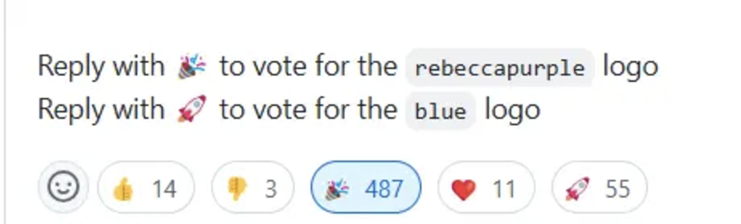
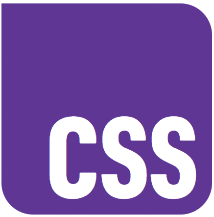
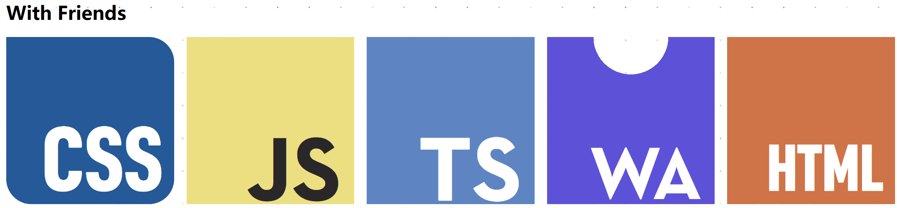
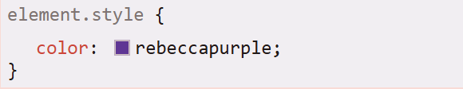

## 前言

最近，[CSS-Next](https://github.com/CSS-Next/css-next) 社区在征集新的 css 的logo，目前社区投票已经结束，最终名为 `rebeccapurple` 颜色的css logo高票胜选 >

> 

投票地址： [css-next#105](https://github.com/CSS-Next/css-next/issues/105#issuecomment-2445341089)

{/* truncate */}

## 最终投票的 两个 CSS logo

最终的两个logo都是经过层层筛选，选到的比较受欢迎的两种设计，具体设计代码可以在 CodePen 上查看：[RC4 logo candidates in a Codepen](https://codepen.io/argyleink/pen/jOgZpmy)

一种是 `rebeccapurple` 色（`#663399`）的logo：



另一种是 `blue` 色的logo：


## 系列logo

值得注意的是，本次投票后的 CSS logo 是跟着其它几种语言（HTML、JavaScript、TypeScript和WebAssembly）的 logo 一起 “出道” 的：



## 为何叫做 `rebeccapurple`

在CSS规范中，早已有 `rebeccapurple` 这个颜色关键词：



早在2014年， `rebeccapurple` 颜色就已经被添加到CSS规范中。而之所以叫做 rebeccapurple , 是2014年为纪念 Eric A. Meyer 的女儿 Rebecca 而添加到CSS规范中的一种颜色。

而这次社区里投票将 `rebeccapurple` 这个颜色作为 CSS 的 logo 的颜色，也算是一种致敬吧！

## SVG

这里分享一个来自社区的新 logo 的 svg 代码（[css-next/issues/105#issuecomment-2450467110](https://github.com/CSS-Next/css-next/issues/105#issuecomment-2450467110)）：

```svg
<svg viewBox="0 0 300 300" fill="none" stroke="white" stroke-width="22">
  <path fill="rebeccapurple" stroke="none" d="
    M0,0 H250
    A 50 50 0 0 1 300 50
    V250
    A 50 50 0 0 1 250 300
    H50
    A 50 50 0 0 1 0 250
    Z" 
  />
  <g id="css" transform="translate(70 220)">
    <path class="C" transform="translate(32 0)" d="
      M 21,-24
      C 21,-33 18,-48 0,-48
      C -18,-48 -21,-33 -21,-24
      V 24
      C -21,28 -18,48 0,48
      C 18,48 21,28  21,24
    " />
    <path class="S" transform="translate(104 0)" d="M 21,-24
      C 21,-33 18,-48 0,-48
      C -18,-48 -21,-33 -21,-24
      C -21,-14 -15,-6.25 0,0
      C 15,6.25 21,14 21,24
      C 21,28 18,48 0,48
      C -18,48 -21,28 -21,24"
    />
    <path class="S" transform="translate(176 0)" d="M 21,-24
      C 21,-33 18,-48 0,-48
      C -18,-48 -21,-33 -21,-24
      C -21,-14 -15,-6.25 0,0
      C 15,6.25 21,14 21,24
      C 21,28 18,48 0,48
      C -18,48 -21,28 -21,24"
    />
  </g>
</svg>
```

<svg viewBox="0 0 300 300" fill="none" stroke="white" stroke-width="22">
  <path fill="rebeccapurple" stroke="none" d="
    M0,0 H250
    A 50 50 0 0 1 300 50
    V250
    A 50 50 0 0 1 250 300
    H50
    A 50 50 0 0 1 0 250
    Z"
  />
  <g id="css" transform="translate(70 220)">
    <path class="C" transform="translate(32 0)" d="
      M 21,-24
      C 21,-33 18,-48 0,-48
      C -18,-48 -21,-33 -21,-24
      V 24
      C -21,28 -18,48 0,48
      C 18,48 21,28  21,24
    " />
    <path class="S" transform="translate(104 0)" d="M 21,-24
      C 21,-33 18,-48 0,-48
      C -18,-48 -21,-33 -21,-24
      C -21,-14 -15,-6.25 0,0
      C 15,6.25 21,14 21,24
      C 21,28 18,48 0,48
      C -18,48 -21,28 -21,24"
    />
    <path class="S" transform="translate(176 0)" d="M 21,-24
      C 21,-33 18,-48 0,-48
      C -18,-48 -21,-33 -21,-24
      C -21,-14 -15,-6.25 0,0
      C 15,6.25 21,14 21,24
      C 21,28 18,48 0,48
      C -18,48 -21,28 -21,24"
    />
  </g>
</svg>

## 参考文章

*   [纪念一个女孩——一个CSS颜色名称背后的故事](https://juejin.cn/post/6844904145065869320)
*   [CSS Gets a New Logo: And It Uses the Color `rebeccapurple`](https://michaelcharl.es/aubrey/en/code/new-rebeccapurple-css-logo)

