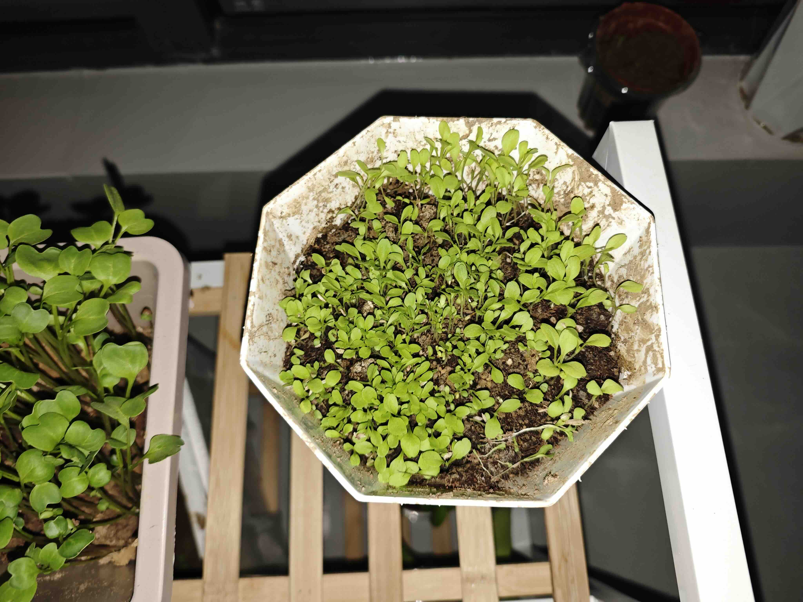
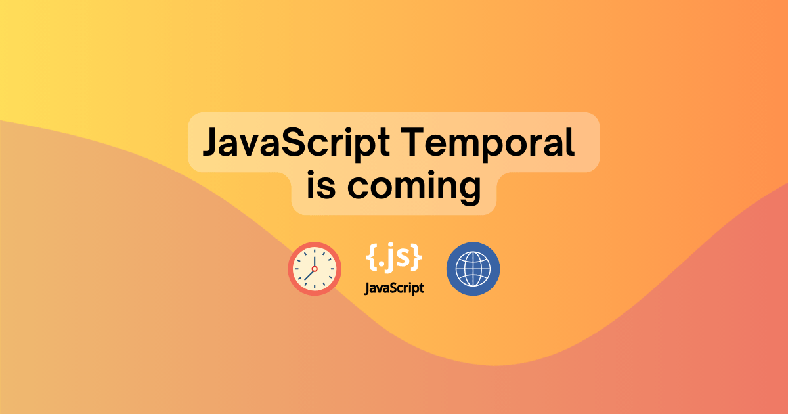

  好消息：阳台种的菜长出来了；
  坏消息：忘记种的啥菜了😂

{/* truncate */}

## 资源
- [Python 学习视频](https://www.bilibili.com/video/BV1kx411e7vE/?p=2&spm_id_from=pageDriver&vd_source=ae76b5cf3a28238e2ca68a9f8e58295b)

## 前端

### [JS 新标准 temporal 即将发布](https://developer.mozilla.org/en-US/blog/javascript-temporal-is-coming/)

`temporal` 的出现是为了解决 `Date` 的各种问题，但目前兼容性不够，慎用。

