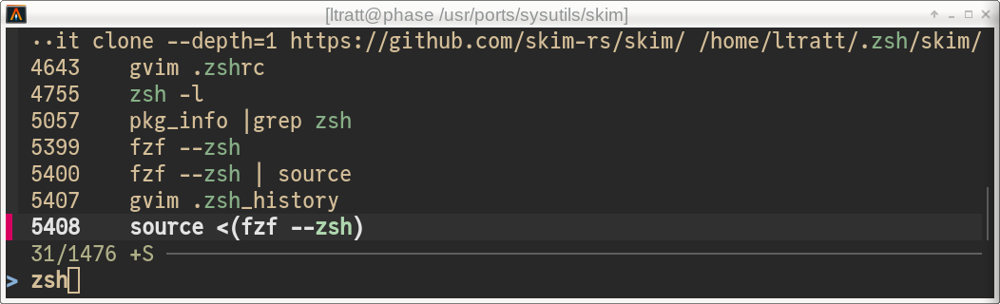

> 分享有趣的事情

{/* truncate */}

## 自动获取每周天气
参考：[Texting myself the weather every day](https://bensilverman.co.uk/posts/daily-weather-sms/)

1. 使用 zapier 的 zap 自动化获取并发布天气预报
2. 写代码实现：获取API（OpenMeteo）、发信息到手机号（国外，Twilio）、自动化执行（GitHub Actions）

## 设置shell的历史搜索提示
[Better Shell History Search](https://tratt.net/laurie/blog/2025/better_shell_history_search.html)

