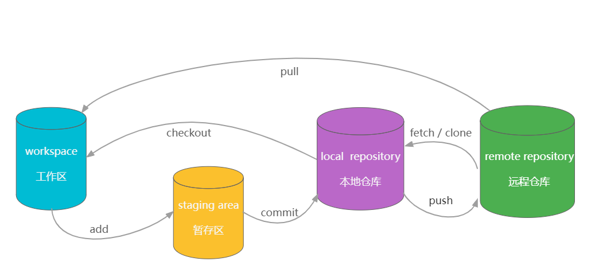

进阶可看官方文档：[git book中文版](https://git-scm.com/book/zh/v2)



### git init

用于初始化项目为 `git` 仓库

### git remote

其后不跟参数，就会打印出已链接到的远程仓库

#### git remote add origin

添加或连接到一个远程仓库，并将其命名为 `origin` ，其后可加 https 地址或 SSH 地址

### git status


用于查看本地仓库的文件状态：tracked、untracked、modified、deleted

### git add

```bash
git add [file] [file2]
git add [dir]
```

用于添加修改（modified）或未跟踪（untracked）的文件到暂存区。

#### git add -a

`git add -a | git add . | git add --all` 用于暂存所有当前目录下未暂存的文件。

### git reset

此命令用于取消文件的存储(将其从暂存区去除)。

#### git commit

此命令用于提交暂存区文件。

#### git commit -m ""

为提交提供提交消息，如果 `git commit` 不指定提交信息，那会默认开启 `vim` ，提示你添加提交信息。

### git commit --amend

修改提交信息（无痕） \- 输入命令后，会自动打开`vim`，让你输入。

### git push -u origin

此命令用于将提交的文件推送到指定分支中的远程存储库（例如GitHub）。  
首次将文件推送到远程存储库时，使用此命令。它将确定您将这些文件推送到的位置。  
下次推送文件时，可以直接使用 `git push`

:::warning 注意

`origin` 是在`git remote add origin` 时赋予该远程仓库的名字！

:::

#### git push

此命令用于将提交的文件推送到远程存储库。使用上一个命令推送文件后，使用此命令将文件推送到远程存储库。

### git fetch

`git fetch` 命令用于从远程获取代码库。检查远程仓库是否修改，如果修改，就拉取到本地仓库。  
该命令执行完后需要执行 `git merge` 远程分支到你所在的分支，合并所有改变（追上远程仓库进度）。

该命令检查所有新的文件、新的分支以及删除的文件。

### git pull

用于从远程获取代码并合并本地的版本。

`git pull` 其实就是 `git fetch` 和 `git merge FETCH_HEAD` 的简写。

```bash
git pull <远程主机名> <远程分支名>:<本地分支名>

# 例子：将远程主机 origin 的 master 分支拉取过来，与本地的 bran 分支合并。
git pull origin master:branch
# 如果远程分支是与当前分支合并，则冒号后面的部分可以省略。
```

### git rm -r --cached


当一个文件已经提交到本地仓库时。后续你再往 `.gitignore` 添加它，也不会起作用。 怎么解除这种追踪呢？ 最常见的做法是直接删除这个文件，流程是：本地删除，提交删除这个commit到仓库。

但这样本地的也会被删除。有时我们只是想删除仓库的副本，可以使用`git rm --cached`, 意思就是不会在实际上删掉这个文件，只是解除它的追踪关系。  
之后再把 需要忽略的文件 添加到 `.gitignore` 即可

```bash
git rm -r --cached test.js
```

`git rm` 经常被用来删除工作区和暂存区的文件。它可以携带一个`cache`参数。  
使用`rm`这个命令时，我们经常会用到`-r`这个命令。`-r`是递归的意思，表示删除整个文件夹，包括它的子文件夹。

### git branch

查看当前所在的分支

#### git branch -a

此命令用于预览本地和远程存储库中的所有分支。

#### git branch -r

此命令用于预览本地存储库中的所有分支（即您已经访问过的分支）。

#### git branch

创建新分支

### git checkout

切换分支

### git checkout --track origin/

此命令用于切换分支。这特别适用于您第一次访问分支（在GitHub/远程存储库中创建）时。

```bash
git checkout --track origin/develop
```
### git merge

此命令用于将两个分支合并在一起。为此，请输入要继承更改的分支。与此命令一起使用的分支名称是提供更改的分支。

```bash
# 分支 master 将要从 develop 分支继承代码（现在位于master分支）
git merge develop
```
#### git merge — abort

遇到合并分支失败后，中止合并

#### git merge -X

此命令用于将两个分支合并在一起。如果存在合并冲突，该命令将假定您更喜欢在提到的分支中所做的更改（而不是当前分支）。

* 冲突的文件使用其它分支 `git merge -Xtheirs <brxxx>`
* 冲突文件使用自己当前分支 `git merge -Xours <brxxx>`

### git reset -hard HEAD

此命令将删除您在本地存储库中所做的所有更改，并将其更新为远程仓库的最新版本。

另外，`git reset --hard HEAD^` 表示回退到上一个版本

### git clean -f

此命令用于删除本地存储库中未跟踪的文件

### git clean -d

此命令用于删除本地存储库中未跟踪的目录。您还可以将它合并到 `git clean-fd` 中，以实现这两个功能。

### git bisect

用于发现在代码中引入错误的提交。它有助于跟踪代码工作的提交和不工作的提交，从而跟踪将错误引入代码的提交。

### git diff

Diff命令在git中用于跟踪文件更改之间的差异。

### git rebase

如果您在分支上工作，但需要在最新的主分支或发布分支上应用该分支的更改，则重新设置基础尤其有用。
```bash
# 在自己的分支feature上开发了一段时间了，准备从主干master（master上有别人开发好的其它功能）上拉一下最新改动
git checkout feature
git rebase master
# 这两条命令等价于git rebase master feature
```
### git stash

`git stash`命令的作用就是将目前还不想提交的但是已经修改的内容进行保存至堆栈中，后续可以在某个分支上恢复出堆栈中的内容。 这也就是说，`stash`中的内容不仅仅可以恢复到原先开发的分支，也可以恢复到其他任意指定的分支上。 `git stash`作用的范围包括工作区和暂存区中的内容，也就是说没有提交的内容都会保存至堆栈中。

*   git stash save 作用等同于git stash，区别是可以加一些注释
*   git stash list
*   git stash pop
*   git stash drop + 名称
*   git stash clear
*   git stash show
*   git stash branch

### git reflog

显示可引用的历史版本记录

### git log

查看提交日志（从开头到目前位置），后面可以跟着一个参数，指定最新的几个日志。
