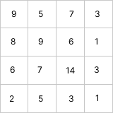

import DifficultyTag from "../../../src/components/DifficultyTag";

# 3148. 矩阵中的最大得分

## 题目描述 <DifficultyTag level={2} />

:::info

题目来源：[LeetCode官网题目](https://leetcode.cn/problems/maximum-difference-score-in-a-grid/description)

:::

给你一个由 **正整数** 组成、大小为 `m x n` 的矩阵 `grid`。
你可以从矩阵中的任一单元格移动到另一个位于正下方或正右侧的任意单元格（不必相邻）。
从值为 `c1` 的单元格移动到值为 `c2` 的单元格的得分为 `c2 - c1` 。

你可以从 **任一** 单元格开始，并且必须至少移动一次。

返回你能得到的 **最大** 总得分。

**示例 1：**


> **输入**：grid = [[9,5,7,3],[8,9,6,1],[6,7,14,3],[2,5,3,1]]  
> **输出**：9  
> **解释**：从单元格 (0, 1) 开始，并执行以下移动：  
> - 从单元格 (0, 1) 移动到 (2, 1)，得分为 7 - 5 = 2 。  
> - 从单元格 (2, 1) 移动到 (2, 2)，得分为 14 - 7 = 7 。  
> 总得分为 2 + 7 = 9 。

**示例 2：**  
> **输入**：grid = [[4,3,2],[3,2,1]]  
> **输出**：-1  
> **解释**：从单元格 (0, 0) 开始，执行一次移动：从 (0, 0) 到 (0, 1) 。得分为 3 - 4 = -1 。  

题目限制：
- `m == grid.length`
- `n == grid[i].length`
- `2 <= m, n <= 1000`
- `4 <= m * n <= 105`
- `1 <= grid[i][j] <= 105`

## 题解
根据题目描述，当前单元格的 **最大** 总得分取决于其左上侧的节点，所以可以使用动态规划解题。

当前单元格的 **最大** 总得分等于其值 减去 其左上侧的节点的最小值。可以得到推导公式：

$$
dp(i,j) = grid(i,j) - \min\limits_{\substack{0<i_0 \leq i \\ 0<j_0 \leq j \\ (i_0 , j_0)\neq(i, j)}}{grid(i_0,j_0)}
$$

使用 dp 保存左上侧的节点的最小值，可以在处理推到 dp 的过程中同时保存当前单元格的 **最大** 总得分。

代码如下：

import Tabs from '@theme/Tabs';
import TabItem from '@theme/TabItem';

<Tabs>
<TabItem value="ts" label="TypeScript">

```ts
function maxScore(grid: number[][]): number {
    const m = grid.length;
    const n = grid[0].length;
    const dp = new Array(m).fill(0).map(() => new Array(n).fill(Number.MAX_SAFE_INTEGER));
    let ans = Number.MIN_SAFE_INTEGER;

    for (let i = 0; i < m; i++) {
        for (let j = 0; j < n; j++) {
            let pre = Number.MAX_SAFE_INTEGER;
            if (i > 0) {
                pre = Math.min(pre, dp[i-1][j]);
            }
            if (j > 0) {
                pre = Math.min(pre, dp[i][j-1]);
            }
            if (i + j > 0) {
                ans = Math.max(ans, grid[i][j] - pre);
            }
            dp[i][j] = Math.min(pre, grid[i][j]);
        }
    }
    return ans;
};
```

</TabItem>
</Tabs>
