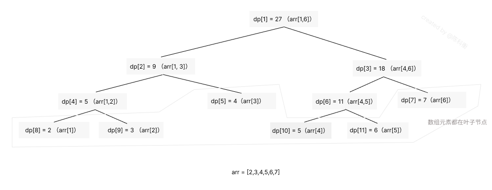

import ChineseP from "@site/src/components/ChineseP"

:::info 百度

<ChineseP>
[线段树](https://baike.baidu.com/item/%E7%BA%BF%E6%AE%B5%E6%A0%91/10983506?fr=ge_ala)是一种二叉搜索树，与区间树相似，它将一个区间划分成一些单元区间，每个单元区间对应线段树中的一个叶结点。
</ChineseP>

<ChineseP>
使用线段树可以快速的查找某一个节点在若干条线段中出现的次数，时间复杂度为$O(logN)$。
而未优化的空间复杂度为`2N`，实际应用时一般还要开`4N`的数组以免越界，因此有时需要离散化让空间压缩。
</ChineseP>

:::

> **线段树** 是著名的用于高效求解 **「区间问题」** 的数据结构。「区间问题」即对于输入数组nums，
在其上执行 **「区间求和」** 、**「区间修改」** 等操作，通常还伴随着针对单个元素的 **「单点查询」** 、 **「单点修改」** 这两种单点操作。
若直接操作 nums ，则单点操作时间复杂度为 O(1) ，而区间操作为 O(n) ；若采用「前缀和」，则区间操作为 O(1) ，
而单点操作为 O(n) 。利用完全二叉树下标特点 (静态堆式线段树) 或动态开点操作 (动态线段树)，
将 nums 上对任意元素值或任意区间值 (区间求和、区间最值等) 的求解，构建在一棵二叉树上，
通过对该二叉树的分治处理 (dfs) ，同时实现 **O(logn)时间复杂度**的单点操作与区间操作 。

数组 -> 基本树状数组 (`PURQ BIT`)  -> 线段树 (`Segment Tree`)

线段树相比基本树状数组，能够支持的操作种类更多，因此对一般的序列区间问题更具 *普适性* 。

## 基本线段树
基本线段树只支持 **「单点修改」** 和 **「区间查询」** 的功能。

### 构建基本线段树
线段树的基本结构就是二叉树，需要将数组每个元素都放在二叉树的[叶子节点](https://baike.baidu.com/item/%E5%8F%B6%E7%BB%93%E7%82%B9/9795627?fromtitle=%E5%8F%B6%E5%AD%90%E8%8A%82%E7%82%B9&fromid=9718763&fr=aladdin)上，
而它们的父节点都是其所有叶子节点的和，即这个数组的区间和。所以，其根节点就是数组的和。

假设有一个数组 `arr = [2,3,4,5,6,7]`，其转化为线段树之后的结构如下图所示：



其中， dp 即为构建的线段树，其在代码里表现为数组形式。  
通过观察，可以发现 dp 的下标是有规律的， dp[i] 的左子节点是 dp[$i \times 2$] 右子节点是 dp[$i \times 2$ + 1]。
如果 dp[i] 代表的是数组 arr[s, t] 的区间的话，那其左子节点是 $arr[s, \frac{s+t}{2}]$，右子节点是 $arr[\frac{s+t}{2} + 1, t]$ 

### 代码实现
> 在实现时，我们考虑递归建树。设当前的根节点为 p，如果根节点管辖的区间长度已经是 1，
> 则可以直接根据 a 数组上相应位置的值初始化该节点。
> 否则我们将该区间从中点处分割为两个子区间，分别进入左右子节点递归建树，最后合并两个子节点的信息。

import Tabs from '@theme/Tabs';
import TabItem from '@theme/TabItem';

<Tabs>
<TabItem value="js" label="JavaScript">

```js
class SegmentTree {
  constructor(arr) {
    this.arr = arr;
    this.dp = new Array(4 * arr.length).fill(0); // 线段树结点数不超过 4*n
    this.build(0, arr.length - 1, 1);
  }
  // 构建线段树
  build(s, t, p) {
    if (s === t) {
      this.dp[p] = this.arr[s];
      return;
    }
    let temp = s + Math.floor((t - s) / 2);
    this.build(s, temp, p * 2);
    this.build(temp + 1, t, p * 2 + 1);
    
    this.dp[p] = this.dp[p * 2] + this.dp[p * 2 + 1];
  }
  getDp() {return this.dp;}
}

// let st = new SegmentTree([2,3,4,5,6,7]);
// st.getDp();
// [ 0, 27, 9, 18, 5, 4, 11, 7, 2, 3, 0, 0, 5, 6, 0, 0, 0, 0, 0, 0, 0, 0, 0, 0 ]
```

</TabItem>

<TabItem value="py" label="Python3">

```py
def build(s, t, p):
    # 对 [s,t] 区间建立线段树,当前根的编号为 p
    if s == t:
        d[p] = a[s]
        return
    m = s + ((t - s) >> 1)
    # 移位运算符的优先级小于加减法，所以加上括号
    # 如果写成 (s + t) >> 1 可能会超出 int 范围
    build(s, m, p * 2)
    build(m + 1, t, p * 2 + 1)
    # 递归对左右区间建树
    d[p] = d[p * 2] + d[(p * 2) + 1]
```

</TabItem>
</Tabs>

以上实现的线段树采用的是**堆式存储**，存在一些无用叶子节点占用空间。
这种实现的线段树占用的最大空间为 $2^{ logn + 1 }$ (n是数组的长度)，其最大值为 4n - 5，一般可以设置数组为 4n。

## 区间查询
区间查询，即求区间 [l,r] 的总和（即 $a_l+a_{l+1}+ \cdots +a_r$）、求区间最大值/最小值等操作。

以上面实现的线段树为例：


- 如果需要查询区间 arr[1,6] 的和，那直接获取 dp[1] 的值即可
- 如果要查询的区间为 arr[3,5]，可以拆成 [3] 和 [4,5] 求得这个区间的答案。

可以看到，如果要查询的区间是 [l,r]，则可以将其拆成最多为 $O(\log n)$ 个 极大 的区间，
合并这些区间即可求出 [l,r] 的答案。

### 代码实现

<Tabs>
<TabItem value="js" label="JavaScript">

```js
class SegmentTree {
  constructor(arr) {
    this.arr = arr;
    this.n = arr.length;
    this.dp = new Array(4 * arr.length).fill(0);
    this.build(0, arr.length - 1, 1);
  }
  build(s, t, p) {
    if (s === t) {
      this.dp[p] = this.arr[s];
      return;
    }
    let temp = s + Math.floor((t - s) / 2);
    this.build(s, temp, p * 2);
    this.build(temp + 1, t, p * 2 + 1);
    
    this.dp[p] = this.dp[p * 2] + this.dp[p * 2 + 1];
  }
  getSum(l, r) { // 驱动函数
    if (l == null || r == null) return new Error("参数不足");
    return this.getSum_inner(l, r, 0, this.n - 1, 1);
  }
  getSum_inner(l, r, s, t, p) { // 求和函数 - 拆分寻找查询区间的所有子集
    // [l, r] 为查询区间, [s, t] 为当前节点包含的区间, p 为当前节点的编号
    if (l <= s && t <= r) { // 当前区间为查询区间的子集
      return this.dp[p];
    }
    let mid = s + Math.floor((t - s) / 2);
    let sum = 0;
    if (l <= mid) {
      sum += this.getSum_inner(l, r, s, mid, p * 2);
    }
    if (r > mid) {
      sum += this.getSum_inner(l, r, mid + 1, t, p * 2 + 1);
    }
    return sum;
  }
}

let st = new SegmentTree([2,3,4,5,6,7]);
st.getSum(3, 5); // 18
```

</TabItem>

<TabItem value="py" label="Python3">

```py
def getsum(l, r, s, t, p):
    # [l, r] 为查询区间, [s, t] 为当前节点包含的区间, p 为当前节点的编号
    if l <= s and t <= r:
        return d[p]  # 当前区间为询问区间的子集时直接返回当前区间的和
    m = s + ((t - s) >> 1)
    sum = 0
    if l <= m:
        sum = sum + getsum(l, r, s, m, p * 2)
    # 如果左儿子代表的区间 [s, m] 与询问区间有交集, 则递归查询左儿子
    if r > m:
        sum = sum + getsum(l, r, m + 1, t, p * 2 + 1)
    # 如果右儿子代表的区间 [m + 1, t] 与询问区间有交集, 则递归查询右儿子
    return sum
```

</TabItem>
</Tabs>

## 单点修改
单点修改，即修改原数组 `i` 位置上的值，在线段树上对应的一系列的节点值都需要随着变化。  
单点修改有两种方式，一种是在原来的值上加/减某个值，另一种是直接变化为某个值。但它们本质上是一样的修改步骤。

最终实现代码如下：

```js
class SegmentTree {
  constructor(arr) {
    this.arr = arr;
    this.n = arr.length;
    this.dp = new Array(4 * arr.length).fill(0);
    this.build(0, arr.length - 1, 1);
  }
  build(s, t, p) {
    if (s === t) {
      this.dp[p] = this.arr[s];
      return;
    }
    let temp = s + Math.floor((t - s) / 2);
    this.build(s, temp, p * 2);
    this.build(temp + 1, t, p * 2 + 1);
    
    this.dp[p] = this.dp[p * 2] + this.dp[p * 2 + 1];
  }
  getSum(l, r) { // 驱动函数
    if (l == null || r == null) return new Error("参数不足");
    return this.getSum_inner(l, r, 0, this.n - 1, 1);
  }
  getSum_inner(l, r, s, t, p) { // 拆分寻找查询区间的所有子集
    // [l, r] 为查询区间, [s, t] 为当前节点包含的区间, p 为当前节点的编号
    if (l === s && r === t) {
        return this.dp[p];
    }
    const mid = s + Math.floor((t - s) / 2);
    if (r <= mid) {
        return  this.sum_inner(l, r, s, mid, p * 2);
    } else if (l > mid) {
        return this.sum_inner(l, r, mid + 1, t, p * 2 + 1);
    } else {
        return this.sum_inner(l, mid, s, mid, p * 2) + this.sum_inner(mid + 1, r, mid + 1, t, p * 2 + 1);
    }
  }
  add(idx, val) {
    this.arr[idx] += val;
    return this.update_inner(idx, val, 0, this.n - 1, 1, "add")
  }
  update(idx, val) {
    this.arr[idx] = val;
    return this.update_inner(idx, val, 0, this.n - 1, 1, "update")
  }
  update_inner(idx, x, s, t, p, type) {
    // idx为需要修改的节点位置，x为修改的值 [s, t] 为当前节点包含的区间, p为当前节点的编号
    if (s === t) {
      if (type === "update") {
        this.dp[p] = x;
      } else {
        this.dp[p] += x;
      }
      return;
    }
    let mid = s + Math.floor((t - s) / 2);
    if (idx <= mid) {
      this.update_inner(idx, x, s, mid, p * 2, type);
    } else {
      this.update_inner(idx, x, mid + 1, t, p * 2 + 1, type);
    }
    this.dp[p] = this.dp[p * 2] + this.dp[p * 2 + 1];
  }
}
```

实际上，由于单点查询和单点修改都可以视作区间长度为 1 的区间查询和区间修改。

## 拓展
### 区间修改与懒惰标记
一般来说，区间修改需要将的所有节点都遍历一次，这种方式需要时间复杂度为 O(N)，
引入一个叫做 「懒惰标记」 的东西，通过延迟对节点信息的更改，从而减少可能不必要的操作次数。

其优化核心在于，寻找需要修改的目标区间的极大区间，将修改的值标记在上面而不是修改dp，等到下一次查询的时候再将该标记清除并修改目标数组。

### 动态开点线段树
> 前面讲到堆式储存的情况下，需要给线段树开 `4n` 大小的数组。
> 为了节省空间，我们可以不一次性建好树，而是在最初只建立一个根结点代表整个区间。
> 当我们需要访问某个子区间时，才建立代表这个区间的子结点。
> 这样我们不再使用 2p 和 2p+1 代表 p 结点的儿子，而是用 $\text{ls}$ 和 $\text{rs}$ 记录儿子的编号。
> 总之，动态开点线段树的核心思想就是：**结点只有在有需要的时候才被创建。**

## 参考资料
- [百度百科](https://baike.baidu.com/item/%E7%BA%BF%E6%AE%B5%E6%A0%91/10983506?fr=ge_ala)
- [LeetCode - 线段树从入门到急停](https://leetcode.cn/circle/discuss/H4aMOn/)
- [OI Wiki - 线段树](https://oi-wiki.org/ds/seg/)

## 相关题目
- 线段树入门题目：[本站 - 307. 区域和检索 - 数组可修改](/docs/leetcode/307/)
- [本站 - 2904](/docs/leetcode/2940/)
