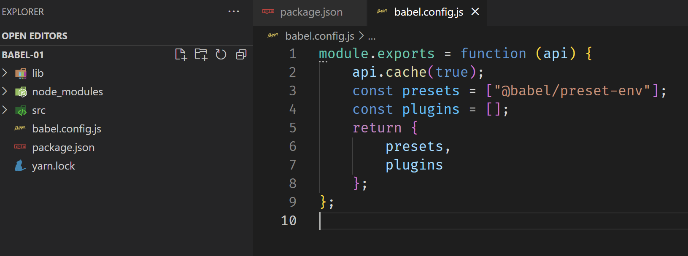
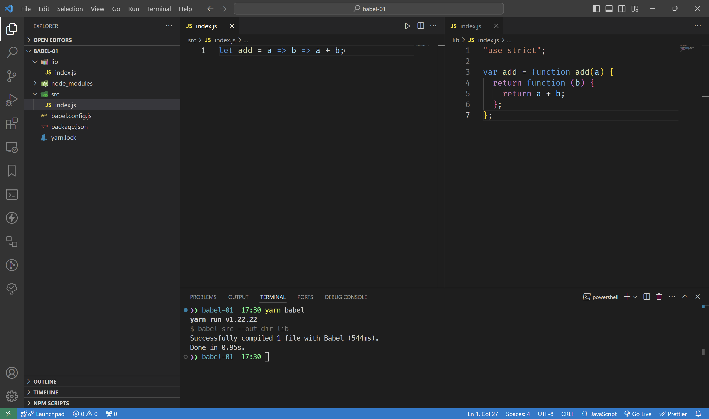

> [Babel](https://babeljs.io/)是前端开发中最常见的第三方工具。许多知名的开源库都依赖于Babel，包括React和vue等。

:::warning

这个 Babel 并非 `the Bible` 

:::

## Babel 的用途

Babel 主要用于三个方面：
1. **转译比较新的语法**，将代码转为兼容性比较高的写法，保证代码可以在旧版本的浏览器中运行；
2. 通过 `polyfill` 方式在目标环境中添加缺失的特性；
3. 源码转换，比如将 `JSX` 语法转为 `React.createElement` 函数；

## Babel 常用包介绍

Babel 将不同的工作分置到几个不同的包中，其中：
- `@babel/core` Babel 的核心包，其它的包都依赖于它。
- `@babel/cli` 包是 Babel 提供的命令行工具，主要提供 Babel 命令。
- `@babel/preset-env` 会根据配置的目标环境生成控件列表并进行编译。以在`package.json`文件的`browserslist`中进行配置。
- `@babel/polyfill` 为代码添加低版本浏览器缺失的特性；

Babel默认只转换新的JavaScript语法，但是不转换新的API，
比如Iterator、Generator、Set、Maps、Proxy、Reflect、Symbol和Promise等全局对象，
以及一些定义在Object对象上的方法等（比如Object.assign）都不会被转换。
如果还想正常执行，就需要使用`@babel/polyfill`了。

> 但是，Babel 7.4 之后不再推荐使用 `@babel/polyfill`，
而 `@babel/preset-env` 和 `plugin-transform-runtime` 二者都可以设置 `corejs` 来处理 `polyfill。`


Babel 只在编译时使用，不需要打包进正式环境，可以用以下命令安装：
```bash
yarn add --dev @babel/core @babel/cli @babel/preset-env
```

## Babel 的配置文件
安装后需要在项目根目录下新建配置文件，并编写自己的配置代码。

Babel 一般有四种配置方式：
1. `babel.config.js` 文件，需要导出一个函数，函数里返回插件数据。**推荐**。（_该配置是项目级别的配置，会影响整个项目中的代码，包括node_modules_）
2. `.babelrc` 配置文件内容为JSON数据结构。（只影响本项目中的代码）
3. 在 `package.json` 文件中配置 `babel` 字段
4. `.babelrc.js` 该配置与`.babelrc`相同, 但是需要使用`JavaScript`实现，返回的是一个json。

### 示例



配置好之后，可以在 package.json 文件中添加一行 scripts，用来运行 babel：

```json
{
    "scripts": {
        "babel": "babel src --out-dir lib"
    }
}
```

其中， `src` 指定的是需要编译的代码，`--out-dir` 用于表明指定的输出地址为 `lib` 。

`src/index.js` 中写入以下代码：

```js
let add = a => b => a + b;
```

运行 `yarn babel`，得到：
```js
"use strict";

var add = function add(a) {
  return function (b) {
    return a + b;
  };
};
```



## Babel 工作过程
> Babel与大多数编译器一样，它的工作过程可分成三部分：解析、转换和代码生成。


## 参考资料
- 《前端开发必知必会：从工程核心到前沿实战 》
- [babeljs.io](https://babeljs.io/docs/usage#polyfill)
